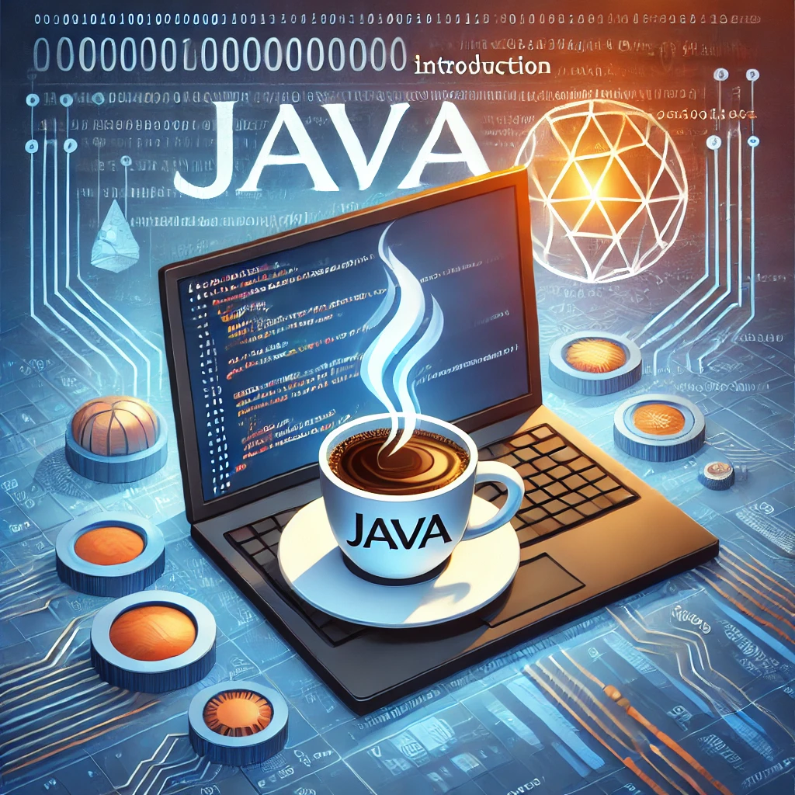
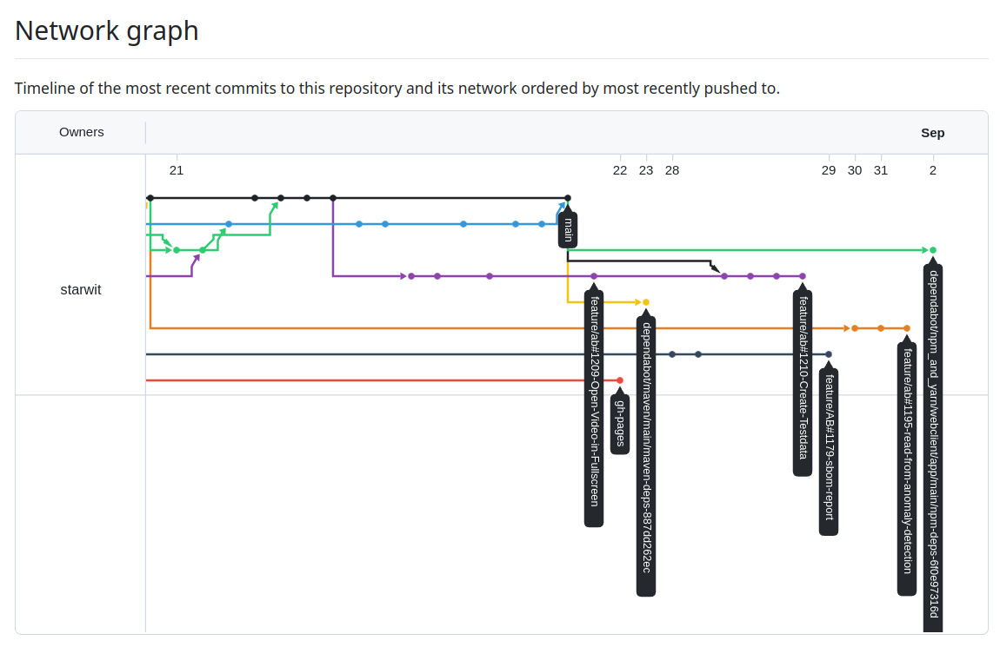

<!-- _class: lead -->
# Java Basics

### 1. Einführung

---

# 1. Einführung in Java
## Agenda  

* Motivation
* Java-Anwendungen
* Java-Geschichte
* Prinzipien
* Java-Plattform
* JVM, JRE, JDK
* IDEs & Links
* Quiz

## Aufgabe

Erstes Programm ausführen: Hallo Welt!

---

# 1. Einführung in Java

## Motivation

* Nenne Unterschiede zwischen einem Programm und einem Betriebssystem.
* Für welche Anwendungsfälle würdet ihr Java nutzen?
* Welche Programmiersprachen kennt ihr?

---

# 1. Einführung in Java

## Java-Anwendungen

Ursprünglich als Sprache für das World Wide Web entwickelt, wird Java aufgrund seiner Plattformunabhängigkeit, Sicherheit und Robustheit in vielen Branchen eingesetzt.

## Anwendungen, die Java nutzen:

* **Webanwendungen** – z. B. Twitter, LinkedIn, Netflix  
* **Mobile Apps** – Android-Apps (Java ist eine primäre Sprache für die Android-Entwicklung)  
* **Unternehmenssoftware** – z. B. ERP-Systeme, Bankensoftware  
* **Spiele** – z. B. Minecraft  
* **Big Data & Cloud Computing** – Hadoop, Apache Spark  
* **KI & Maschinelles Lernen** – TensorFlow, Deeplearning4j  
* Java wird oft als Backend verwendet, während das Frontend auf JavaScript basiert.

---

# 1. Einführung in Java

## Java-Geschichte

* Entwickelt von James Gosling bei Sun Microsystems, veröffentlicht im Mai 1995.
* 1998 Einführung des Java Community Process:
  * Mitglieder heute: Alibaba, Amazon, ARM, Azul Systems, IBM, Intel, JetBrains, Microsoft, Oracle, SAP, u. v. m.
* 2006/2007 Java Virtual Machine (JVM) wird als Open-Source-Software unter GPL-2.0-only lizenziert.
* 2010 Übernahme von Sun Microsystems durch Oracle.
* 2017 Jakarta EE wechselt zur Eclipse Foundation.

---

# 1. Einführung in Java

## Prinzipien

* Einfach, **objektorientiert** und vertraut (inspiriert von C++, Smalltalk, Eiffel, Objective-C).
* Robust und sicher (**automatische Speicherverwaltung**, keine Pointer-Arithmetik nötig).
* Architekturneutral und portabel (**plattformunabhängig**).
* Hohe Leistung.
* **Interpretiert**, threaded und dynamisch:
  * Java-Interpreter führt Java-Bytecode direkt aus, Klassen werden bei Bedarf verlinkt.
  * **Multithreading und Thread-safe**.
* **Typsicherheit**.

Quelle: [Oracle Java Einführung](https://www.oracle.com/java/technologies/introduction-to-java.html)

---

# 1. Einführung in Java

## Java-Plattform

Verschiedene Plattformen für unterschiedliche Gerätetypen und Anwendungsbereiche:

* **Java Card:** Sicheres Ausführen von kleinen Java-Applets auf Smartcards.
* **Java ME (Micro Edition):** Für Geräte mit begrenzten Ressourcen (z. B. Handys, Set-Top-Boxen).
* **Java SE (Standard Edition):** Allgemeine Nutzung auf PCs und Servern.
* **Jakarta EE (Enterprise Edition):** Erweiterung von Java SE für Unternehmensanwendungen.

---

# 1. Einführung in Java

## JVM, JRE, JDK

* **JVM (Java Virtual Machine):** Kernstück der Java-Technologie, führt Bytecode aus.
* **JRE (Java Runtime Environment):** Umgebung für die Ausführung von Java-Anwendungen.
* **JDK (Java Development Kit):** Entwicklungswerkzeuge zum Kompilieren, Debuggen und Ausführen.

Quelle: [IBM JVM vs. JRE vs. JDK](https://www.ibm.com/think/topics/jvm-vs-jre-vs-jdk)

---

# 1. Einführung in Java

## Programmiersprachen auf der JVM

Neben Java laufen viele weitere Sprachen auf der JVM:

* **Java** – statisch typisierte, objektorientierte Sprache.
* **Kotlin** – von JetBrains entwickelt, bevorzugte Sprache für Android.
* **Scala** – objektorientiert und funktional.
* **Groovy** – dynamische Programmiersprache.
* **Clojure** – funktionale Lisp-Variante für die JVM.

Quelle: [Liste der JVM-Sprachen](https://en.wikipedia.org/wiki/List_of_JVM_languages)

---

# 1. Einführung in Java

## Git Überblick

* Ermöglicht parallele Zusammenarbeit durch Versionskontrolle.
* Branches helfen, verschiedene Features separat zu entwickeln.
* Wichtige Befehle:
  * `git clone https://...` – Repository klonen.
  * `git add .` – Änderungen zur Staging-Area hinzufügen.
  * `git commit -m "Message"` – Änderungen lokal speichern.
  * `git push` – Änderungen ins Remote-Repository hochladen.
  * `git pull` – Neueste Änderungen abrufen.

---

# 1. Einführung in Java

## Git Branches und Workflow

---

# 1. Einführung in Java

## Git Pull Requests / Merge Requests

* Feature-Branches werden über Pull Requests zusammengeführt.
* Code kann vor dem Merge überprüft und freigegeben werden.

## Vorteile von Git

* Getrennte Entwicklung in eigenen Branches ohne Konflikte.
* Kontrollierte Code-Reviews vor dem Deployment.
* Versionierung von Code-Historien und parallele Releases.

---

# 1. Einführung in Java

## IDEs (Integrierte Entwicklungsumgebungen)

* Visual Studio Code
* IntelliJ IDEA
* Eclipse
* NetBeans

## Nützliche Links

* [Java Wikipedia](https://de.wikipedia.org/wiki/Java_(Programmiersprache))
* [Offizielles Java-Tutorial](https://docs.oracle.com/javase/tutorial/)
* [Liste der JVM-Sprachen](https://en.wikipedia.org/wiki/List_of_JVM_languages)
* [JVM, JRE, JDK](https://www.ibm.com/think/topics/jvm-vs-jre-vs-jdk)

---

# 1. Einführung in Java

## Quiz

* Aus welchen Teilen besteht die Java-Plattform?  
* Was ist der Unterschied zwischen einem Interpreter und Compiler? Wo wird in Java was genutzt?  
* Aus welchen Dateien besteht ein Java-Projekt?  
* Auf welchen Prinzipien basiert Java?  
* Warum lässt sich mit Java geschriebener Code einfacher auf andere Systeme (Mikroprozessoren/Betriebssysteme) übertragen?  
* Wann und warum sollte man Git benutzen?  
* Was ist der Unterschied zwischen Debuggen und Ausführen?

---

<!-- _class: image -->
# 1. Einführung in Java

