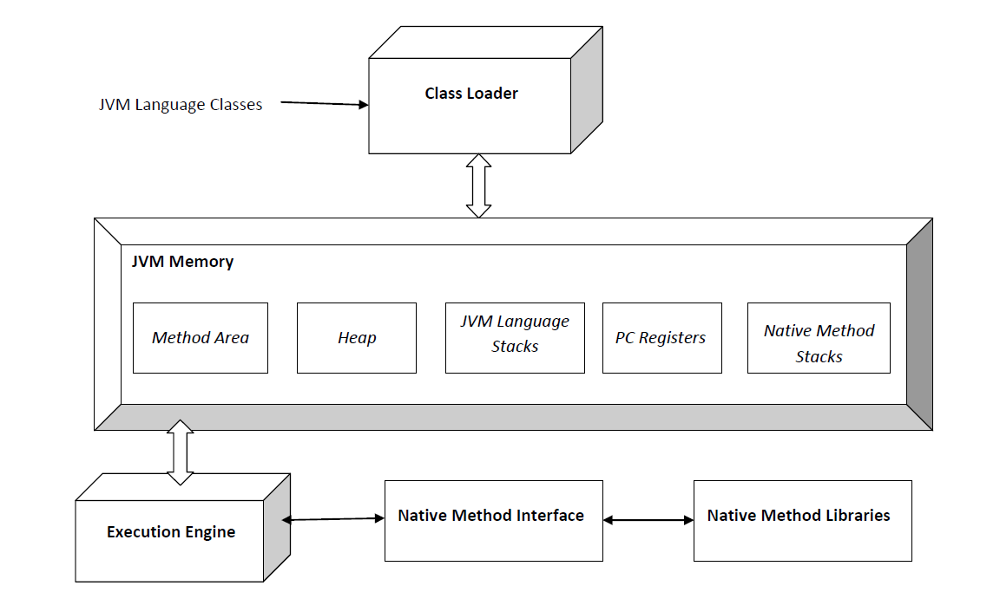

<style>
header {
  text-align: right;
  font-size: 0.7rem;
  color: #bbb;
  margin: 20px;
  left: 0px;
  right: 0px;
  padding-top: 5px;
}
footer {
  font-size: 0.9rem;
  color: #666;
}

section.lead h1 {
  position: relative;
  font-size: 2.0rem;
  text-align: center;
}
section.lead {
  text-align: center;
  margin-bottom: 40px;
}

section {
  font-size: 1.5rem;
}

section.linked footer {
  display: none;
}
section.linked header {
  display: none;
}
section.image {
  font-size: 0.7rem;
  text-align: center;
  color: #555;
}

h1 {
  position: absolute;
  top: 10px;
  padding-top: 15px;
  text-transform: uppercase;
  font-size: 2.0rem;
  font-weight: 500;
  color: #2B5A6A;
}

h2 {
  font-size: 2.0rem;
  font-weight: 500;
  color: #2B5A6A;
  margin-top: 30px;
  margin-bottom: 15px;
  text-align: left;
}

section.lead h2 {
  font-size: 2.0rem;
  font-weight: 500;
  color: #2B5A6A;
  margin-top: 30px;
  margin-bottom: 15px;
  text-align: center;
}

a {
  color: #3A9FC1;
}
a:hover {
  color: #1E708B; 
  text-decoration: underline; 
}

</style>

<!-- _class: lead -->
# Java Basics


### 1. Setup & Tools

---

# 1. Setup & Tool

## Agenda  

* Motivation
* Java-Powered Applications
* Java History
* Principles
* Java Platform (JDK, JRE, JVM)
* Git
* IDE & Links
* Quiz

## Task

Run first Programm: Hello World!

---

# 1. Setup & Tool

## Motivation

* describe differences between a program and an operating system.  
* For which use cases would you use Java?  
* Which programming languages do you know?

---

# 1. Setup & Tool

## Java-Powered Applications

Originally developed as language for the world wide web, Java is widely used across various industries due to its platform independence, security, and robustness.

## Applications Running Java

* **Web Applications** – e.g., Twitter, LinkedIn, Netflix  
* **Mobile Apps** – Android apps (Java is a primary language for Android development)  
* **Enterprise Software** – e.g., ERP systems, banking software  
* **Games** – e.g., Minecraft  
* **Big Data & Cloud Computing** – Hadoop, Apache Spark  
* **AI & Machine Learning** – TensorFlow, Deeplearning4j 
* it is common to use Java as backend while using a Javascript-based frontend

---

# 1. Setup & Tool

## Java History

* designed by James Gosling at Sun Microsystems, release in May 1995
* 1998 Java Community Process
  * members today: Alibaba, Amazon.com, Services, Inc., Arm Ltd, Azul Systems, Bellsoft , BNY Mellon, Eclipse, Ken Foge, Fujitsu, IBM , Intel, Japan JUG, JetBrains, MicroDoc, Microsoft, Oracle, SAP, SouJava 
* 2006, 2007 Java virtual machine (JVM) as free and open-source software (FOSS), under the terms of the GPL-2.0-only license
* 2010 Oracle aquired SUN and Java
* 2017 Jakarta EE goes to Eclipse Foundation

---

# 1. Setup & Tool

## Principles

* It must be simple, **object-oriented**, and familiar.
  * inpired by C++, Smalltalk, Eiffel, ObjectiveC
* It must be robust and secure.
  * **automatic garbadge collection**, no pointer arithmetic needed
* It must be architecture-neutral and portable.
  * **platform-independent**
* It must execute with high performance.
* It must be **interpreted**, threaded, and dynamic.
  * Java interpretor runs Java bytecode directly,classes are linked as needed
  * **multiy-threaded and thread-safe**
* **type-save**

Source: https://www.oracle.com/java/technologies/introduction-to-java.html

---

# 1. Setup & Tool

## Java Platform

Different platforms target different classes of device and application domains:

* **Java Card:** A technology that allows small Java-based applications (applets) to be run securely on smart cards and similar small-memory devices.
* **Java ME (Micro Edition):** Specifies several different sets of libraries (known as profiles) for devices with limited storage, display, and power capacities. It is often used to develop applications for mobile devices, PDAs, TV set-top boxes, and printers.
* **Java SE (Standard Edition):** For general-purpose use on desktop PCs, servers and similar devices.
* **Jakarta EE (Enterprise Edition):** Java SE plus various APIs which are useful for multi-tier client–server enterprise applications.

---

# 1. Setup & Tool

## JVM, JRE, JDK

* **JVM (Java Virtual Runtime)**: Included in both, JRE and JDK. Loads, verifies, and runs Java bytecode. It is known as the interpreter or the core of the Java programming language because it runs Java programming.
* **Java Runtime Environment, or JRE**, is a set of software tools responsible for execution of the Java program or application on your system.
* **Java Development Kit, or JDK**, is a software development kit that is a superset of JRE. JDK contains all the tools that are required to compile, debug, and run a program developed using the Java platform.

Source: https://www.ibm.com/think/topics/jvm-vs-jre-vs-jdk

---
<!-- _class: image -->
# 1. Setup & Tool

## The Java virtual machine - run everywhere



By Michelle Ridomi - Own work, CC BY-SA 4.0, https://commons.wikimedia.org/w/index.php?curid=35963523

---

# 1. Setup & Tool

## Java Development Kit

**javac** - read Java class and interface definitions and compile them into bytecode and class files

**java** - launch a Java application

**jar** - creates an archive for classes and resources, and can manipulate or restore individual classes or resources from an archive. The jar command is a general-purpose archiving and compression tool, based on the ZIP and ZLIB compression formats.

---

# 1. Setup & Tool

## Java Development Kit Example

Root folder: ```quiz```
Compile in bytecode:

```bash
mkdir classes
javac src/main/java/de/starwit/Quiz.java -d classes
```

Execute Java program:

```bash
java src/main/java/de/starwit/Quiz.java
cd classes
java de.starwit.Quiz
```

Create and execute archive:

```bash
jar --create --file foo.jar --main-class de.starwit.Quiz -C classes .
java -jar foo.jar
```

---

# 1. Setup & Tool

## Programming Languages running on JVM

The JVM was initially designed to support only the language Java. However, over time, ever more languages were adapted or designed to run on the Java platform.

* **Java** a statically-typed object-oriented language
* **Kotlin** a statically-typed language from JetBrains, the developers of IntelliJ IDEA[3] and Google's preferred language for Android
* **Scala** a statically-typed object-oriented and functional programming language
* **Groovy** a dynamic programming language (also with static typing) and scripting languag
* **Clojure** a dynamic, and functional dialect of the Lisp programming language

Source: https://en.wikipedia.org/wiki/List_of_JVM_languages

---

# 1. Setup & Tool

## Git Overview

* in order to work together, you need to handle parallel changes of your team
* Git is a version control system designed to do this
* you work with branches e.g. to separate different features from each other
* important commands:
  * `git clone https://...` clones a project from a git repository to your lokal file system
  * `git add .` adds your changes to a stage
  * `git commit .` commits your changes in your local branch
  * `git push` pushes your changes to remote branch
  * `git pull` get the latest changes from your repository

---
<!-- _class: image -->
# 1. Setup & Tool

## Git Branches and Workflow


---

# 1. Setup & Tool

## Git Pull Requests / Merge Requests

* to merge feature branches in the main branch, pull request or merge requests can be created
* a pull request can be reviewed and approved before merging

## Git Advantages

* you can work in a separated version of code (branch) without disturbing anyone
* contolled way to do reviews before code is going live
* building and maintaining more than one release is possible
* versioned code history

---

# 1. Setup & Tool

## IDE (Integrated Development Environment)

* Visual Studio Code
* IntelliJ
* Eclipse
* NetBeans

## Links / Sources

* [Java Programming Language in Wikipedia](https://en.wikipedia.org/wiki/Java_(programming_language))
* [Offical tutorial](https://docs.oracle.com/javase/tutorial/)
* [List of JVM Languages](https://en.wikipedia.org/wiki/List_of_JVM_languages)
* [JVM, JRE, JDK](https://www.ibm.com/think/topics/jvm-vs-jre-vs-jdk)

---
# 1. Setup & Tool

## Quiz

* What are the parts of the Java platform?  
* What is the difference between an interpreter and a compiler? Where is each used in Java?  
* What files make up a Java project?  
* What principles is Java based on?  
* Why is Java-written code easier to transfer to other systems (microprocessors/operating systems)?  
* When and why should you use git?  
* What is the difference between debugging and running a java program?  

---
<!-- _class: image -->
# 1. Setup & Tool

## see [readme](Readme.md) for tasks

