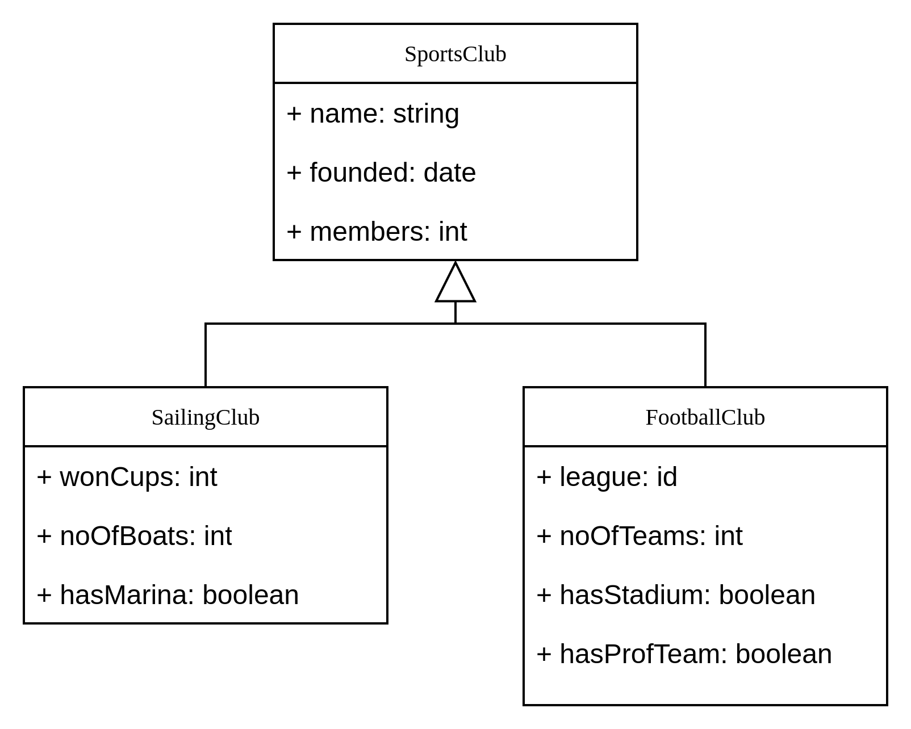
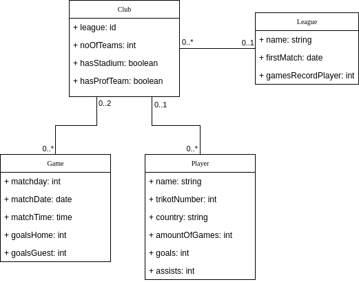
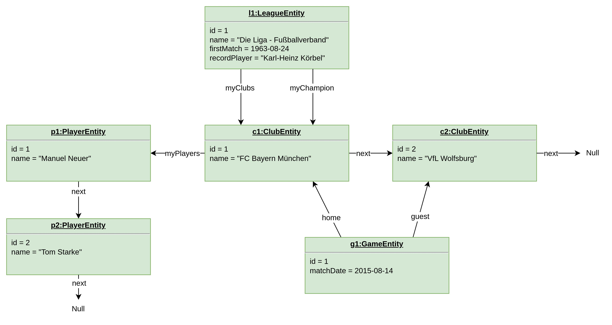
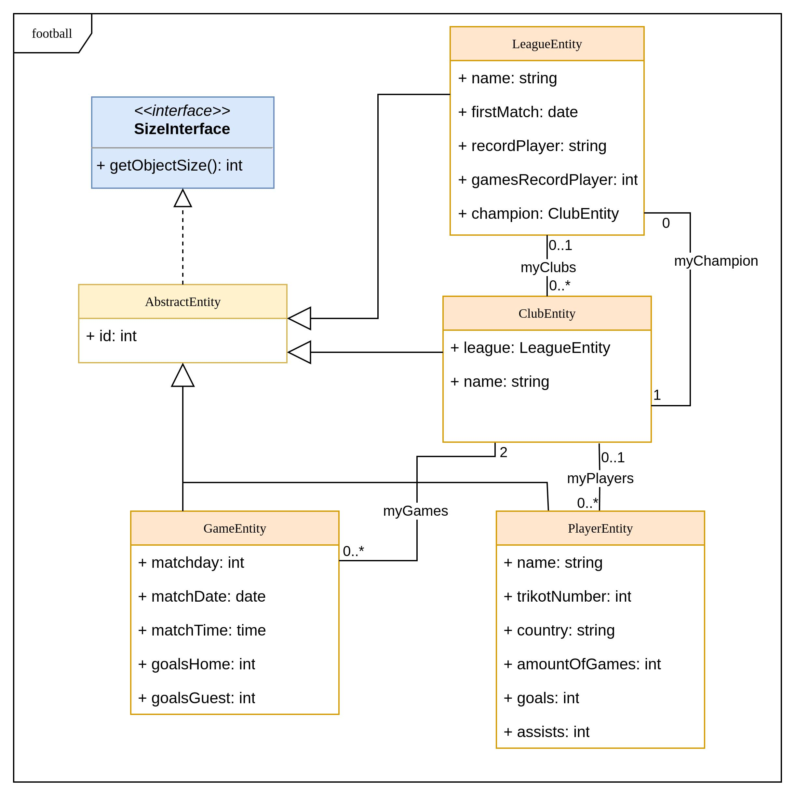

# Introduction object orientation in Java

Modeling problem domains with objects has proven to be a powerful concept to write good software. In this section we will learn how Java deals with classes and objects. 

## Introduction to object orientation

OO is based on a bunch of fundamental concepts. This subsection will introduce them (very) briefly. It is highly recommended, that you consult further literature e.g. [Wikipedia](https://en.wikipedia.org/wiki/Object-oriented_programming).

Modeling data can often be easier using graphic representations. Diagrams used in this chapter were created using [DrawIO](https://www.drawio.com/) and it is highly recommended to make yourself familiar with that tool too - it is handy in many situations.

### Classes and objects
The fundamental concept of every object oriented language is the idea of classes and objects. A class is a description of data and behaviour (== methods). So it wraps functions and data into one structure. Once this is defined, one create as many instances of this class as are necessary. Given the example below, once you have defined which data and functions are necessary to describe a sport club, you can create an object of this class for every real world club, that you want to manage.

In short, a class is:
* a blueprint of an object
* defines data (attributes/variables) and functionality (methods)

### Encapsulation
* Information & methods regarding a topic are stored inside an object
* Expose only those parts of code that are necessary
* Thus hiding all internal implementation parts
* Example: As a user, you don't need to know, how an engine works. Yet with the exposed functions (steering wheel, brakes, ...) you can perfectly use a car.

### Abstraction
* This is one of the most powerful modeling concepts in computer science
* Usually it comes in layers
* Core idea is, that underneath an exposed set of functions (aka API), a specific implementation can be exchanged, without breaking the API using code.
* Most prominent example is ISO/OSI model for networking. TCP can be used, regardless of the underlying network technology.
* This concept goes way beyond object orientation and you should study it whenever you look at successful software projects.
* __Note__ This concept dominates software development and especially in Java it enables you, to write highly reusable code.

### Inheritance
* Reuse code (!)
* add small changes to a shared set of data/functions
* Looking at the car example - every car has (at least) four wheels, a number of seats, a color,... its engine can turned on/off, lights can be turned on/off. So this would be data and functions for a base class and now you can create classes for passenger cars, commercial vehicles, busses, ... Each of which extends or modify the base class.
* Software projects usually have a sophisticated hierachy of classes with inheritence. 
* A set of classes can be packed into a library such, that many development projects, use the same data structures.

### Polmorphism
* Inherit methods with the same signature, but different implementations
* In inheritence hierachies classes can not only add, but also modify bevahiour. 
* In the car example, each of the inheriting classes could its own function to model acceleration. So every class has the same functionality, it's implementation can be very different.

## On Modeling
Now it is time, to look at a real word example. Let's imagine, we want to build an app, that manages sport events. The following picture shows an example of several classes and the idea of inheritance. The notation used here is called class diagram and is part of the [unified modeling language](https://en.wikipedia.org/wiki/Unified_Modeling_Language).



Core idea here is, that a football club __is a__ sports club and thus inherits all attributes. Same goes for sailing clubs or any other kind of sports club, on could think of. All of those will have a name, a founding date and a number of members.

The next diagram shows a bunch of clases and their relations amongst each other. General idea is, that larger data structures can be broken into fitting entities like clubs, players,... and then connect them via relations. So a club for example has a number of players and is playing in a certain league.



### Object diagrams
As explained, classes are templates for objects. So from a class definition any number of concrete instances can be created. The following diagram shows an example for a set of instances for the classes defined in last section. As you can see, for every entity at least one instance exists and relationships between these instances/objects are shown. It is obvious, that this kind of diagram will become very large even for simple use cases. 



Note that instances show only a subset of their respective classes. 

### Example for this course
For the following examples we will model data for a football league. Our main domain entities will be league, club, player and game. Leagues represents a football league like the first German football leauge (Bundesliga) and clubs are the football clubs, that play in their respective league. 

The following picture shows a model subset from last subsection, that we are going to implement. It is focussing on football clubs and each of the items in this diagram will end up in a piece of code.



Every entity from the football application domain is represented by a class. As we will deal with many instances for every class e.g. there will 18 clubs for the first German football league. So we need a mechanism to tell those instances apart. For this a unique id is used and as this is necessary for all classes, attributes and logic needed are put in an AbstractEntity class from which all others will inherit.

In this course we will use DrawIO to create UML diagrams. It as free tool and you can use it in a number of ways:
* [online](https://app.diagrams.net/)
* [download](https://github.com/jgraph/drawio-desktop/releases/tag/v26.0.9) app for your operating system
* [VSCode plugin](https://marketplace.visualstudio.com/items?itemName=hediet.vscode-drawio)

### Tasks
* Open [sample file](modeling/OO-concepts.drawio)
* Extend diagram:
  * number of visitors watching a game
  * A club can have a stadium or not
  * An additional class that holds post address for a club
* Now let's consider the exciting idea of a chess league and model it using UML
  * Collect all necessary information to model chess clubs/leagues
  * Draw a UML Diagram for league/clubs
  * A (German) example for a chess league can be found [here](https://www.schachbundesliga.de/teams/2024/bl)
  * __Bonus Challenge__ Model also players and games.

## Example list

### Football representing class hierachy
This example introduces a set of classes, representing a football league. Execute the following commands:
```bash
    cd football
    mvn clean package
    java -jar target/football.jar
```

#### Tasks
* Run app
* create a class definition for all four csv files in folder data
* parse all of them and create according lists with entries
* make lists holding parsed objects as object variables
* make file location CLI parameters
* Add SizeInterface to AbstractEntity and implement method in all classes accordingly
* add Serializable interface to classes - what does that do?
* implement function, that returns LeagueEntity for given Club - change method signature accordingly
* Can you think of a better way, to handle this?


### Working with stream API
Stream API is a library in Java that helps you working with lists, arrays, ... You can filter elements or do something for each element. One of the great advantages is, that those operations can be executed in parallel. If applicable, this can accelerate you software drastically.
__Note__: Please consider looking into chapters collections and lambdas in the next section, before you try to solve tasks here.

```bash
    cd football_streams
    mvn clean package
    java -jar target/football-streams.jar
```

#### Tasks
* Run app
* get your parsing methods from last example
* ClubEntities hold an id for LeagueEntity -> let's create a proper object reference using map function, replace static list with parsed leagues from CSV file
* Now connect all Entities with proper references